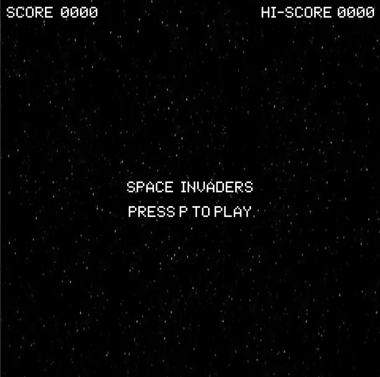
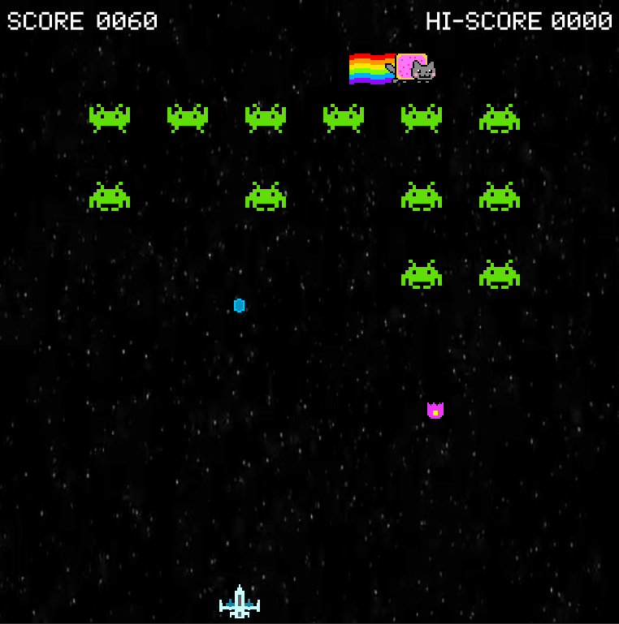

# Space Invaders

[Space Invaders](https://en.wikipedia.org/wiki/Space_Invaders) (Japanese: スペースインベーダー, Hepburn: Supēsu Inbēdā)
 is a popular 1978 arcade game created by Tomohiro Nishikado. This is my inspired version of that game.

## Dependencies
  - [cmake](https://cmake.org/)
  - [cinder](https://libcinder.org/)
  - [Cinder-WMFVideo](https://github.com/stimulant/Cinder-WMFVideo) 
  - [Cinder-poSpritesheet](https://github.com/Potion/Cinder-poSpritesheet)
  - [Cinder-poScene](https://github.com/Potion/Cinder-poScene) 

You can use my forked versions for [Cinder-WMFVideo](https://github.com/ylim31/Cinder-WMFVideo),
[Cinder-poSpritesheet](https://github.com/ylim31/Cinder-poSpritesheet),
and [Cinder-poScene](https://github.com/ylim31/Cinder-poScene) which includes the Configure.cmake files. 

## Requirements
  - Cinder-WMFVideo: Up to date video driver as WGL_NV_DX_interop behaves poorly with older drivers.
  - If you're using Cinder-poSpritesheet in conjunction with poScene, make sure you're on poScene v2.
  - If you're on an old project with Cinder 0.8.6, you can checkout the v0.8.6 tag.
  - Read their README.md for more details.

## Controls    
| Key          | Action                                                      |
|------------- |-------------------------------------------------------------|
| `left arrow` | Move to the left                                            |
| `right arrow`| Move to the left                                            |
| `SPACE`      | Shoot                                                       |
| `r`          | Restart game                                                |
| `p`          | Play game                                                   |

## Score  
| Type         | Points                                                      |
|------------- |-------------------------------------------------------------|
| Alien        | 10                                                          |
| Nyan Cat     | 50                                                          |
  
**Author**: Josh Lim - [`ylim31@illinois.edu`](mailto:ylim31@illinois.edu)
